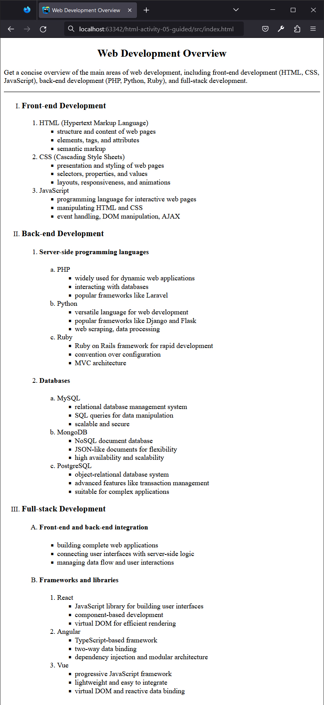
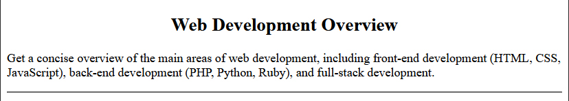
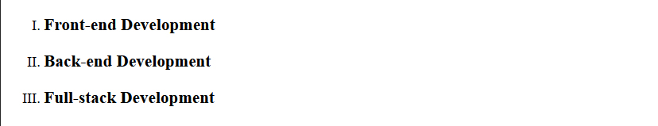
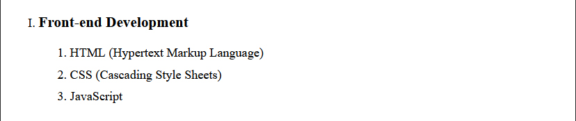
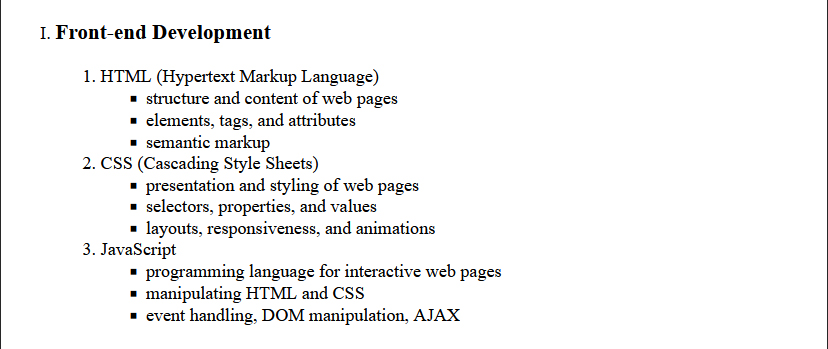
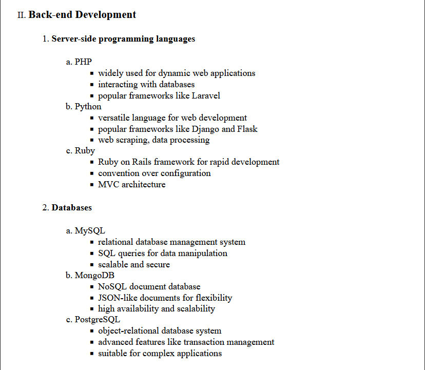
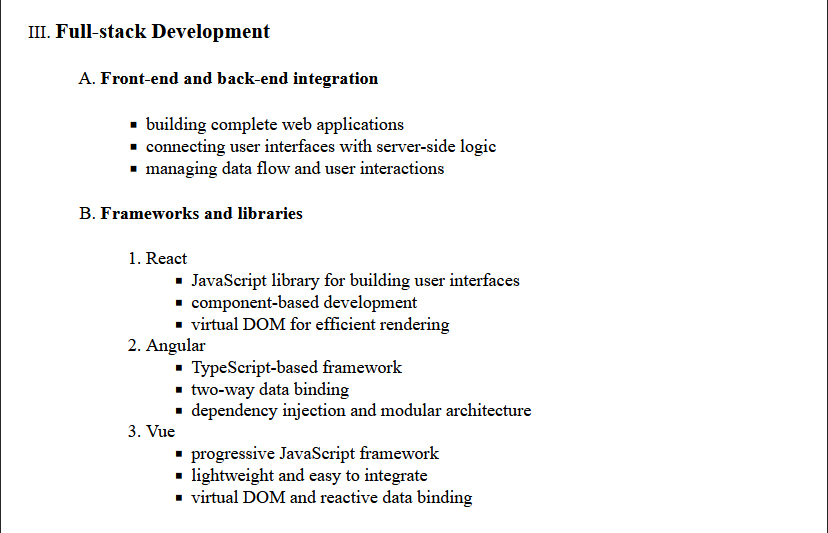

## HTML | Activity #5 (Guided): Nested Lists
In this activity, we will create an **Topic Outline Page** with the following content:




### Development Setup
Create your `index.html` file inside the [**src**](/src) folder in this project,
then follow along with this guide.

To test your output, simply open it in your preferred web browser.

### Template
First, we need a regular HTML template that already contains the intro content.



```html
<!DOCTYPE html>
<html lang="en">
<head>
    <meta charset="UTF-8">
    <title>Web Development Overview</title>
</head>
<body>

    <div class="intro">
        <h2 align="center">Web Development Overview</h2>
        <p>
            Get a concise overview of the main areas of web development,
            including front-end development (HTML, CSS, JavaScript),
            back-end development (PHP, Python, Ruby), and full-stack development.
        </p>
        <hr/>
    </div>

</body>
</html>
```


### Main List
The main list consists of the major domains of web development. 



This is an **ordered list** with a type of `"I"` to denote *uppercase roman numerals*.

We will write the [comments](https://www.w3schools.com/html/html_comments.asp)
as a markers to track our position in the nested list.

```html
    ...

    <ol type="I">
        <!-- I. Front-end Development -->
        <li>
            <h3>Front-end Development</h3>
        </li>

        <!-- II. Back-end Development -->
        <li>
            <h3>Back-end Development</h3>
        </li>

        <!-- III. Full-stack Development -->
        <li>
            <h3>Full-stack Development</h3>
        </li>
    </ol>

</body>
</html>
```

You can use any element inside the `<li>` tag.
This time, we used `<h3>` tags to highlight the list items in our first list. 


### Front-end Development
Let's focus on the first item on our main list,
which is **Front-end Development**.
Notice that below it is another **ordered list**.



So we need to nest another `<ol>` tag inside it.

```html
        ...

        <!-- I. Front-end Development -->
        <li>
            <h3>Front-end Development</h3>
            <ol>
                <!-- 1. HTML (Hypertext Markup Language) -->
                <li>
                    HTML (Hypertext Markup Language)
                </li>
        
                <!-- 2. CSS (Cascading Style Sheets) -->
                <li>
                    CSS (Cascading Style Sheets)
                </li>
        
                <!-- 3. JavaScript -->
                <li>
                    JavaScript
                </li>
            </ol>
        </li>

        ...
```

Now that that's done, notice that each item inside the `<ol>`
that we have nested has another **unordered list**.



So we need to nest `<ul>` tag inside each of it.

```html
        ...

        <!-- I. Front-end Development -->
        <li>
            <h3>Front-end Development</h3>
            <ol>
                <!-- 1. HTML (Hypertext Markup Language) -->
                <li>
                    HTML (Hypertext Markup Language)
                    <ul>
                        <li>structure and content of web pages</li>
                        <li>elements, tags, and attributes</li>
                        <li>semantic markup</li>
                    </ul>
                </li>
        
                <!-- 2. CSS (Cascading Style Sheets) -->
                <li>
                    CSS (Cascading Style Sheets)
                    <ul>
                        <li>presentation and styling of web pages</li>
                        <li>selectors, properties, and values</li>
                        <li>layouts, responsiveness, and animations</li>
                    </ul>
                </li>
        
                <!-- 3. JavaScript -->
                <li>
                    JavaScript
                    <ul>
                        <li>programming language for interactive web pages</li>
                        <li>manipulating HTML and CSS</li>
                        <li>event handling, DOM manipulation, AJAX</li>
                    </ul>
                </li>
            </ol>
        </li>

        ...
```

That's how we nest lists.
Inside an `<li>` tag, we can create another `<ol>`, `<ul>`, or even `<dl>`
with their own list items when necessary.


### Back-end Development
We can apply the same list-nesting pattern to the items of **Back-end Development**.



Notice that its sub-list is an `<ol>` with two list items.
Each of those list items has another sub-list of `<ol type="a">`, and finally a `<ul>`.

```html
        ...

        <!-- II. Back-end Development -->
        <li>
            <h3>Back-end Development</h3>
            <ol>
                <!-- 1. Server-side programming languages -->
                <li>
                    <h4>Server-side programming languages</h4>
                    <ol type="a">
                        <!-- a. PHP -->
                        <li>
                            PHP
                            <ul>
                                <li>widely used for dynamic web applications</li>
                                <li>interacting with databases</li>
                                <li>popular frameworks like Laravel</li>
                            </ul>
                        </li>
        
                        <!-- b. Python -->
                        <li>
                            Python
                            <ul>
                                <li>versatile language for web development</li>
                                <li>popular frameworks like Django and Flask</li>
                                <li>web scraping, data processing</li>
                            </ul>
                        </li>
        
                        <!-- c. Ruby -->
                        <li>
                            Ruby
                            <ul>
                                <li>Ruby on Rails framework for rapid development</li>
                                <li>convention over configuration</li>
                                <li>MVC architecture</li>
                            </ul>
                        </li>
                    </ol>
                </li>
        
                <!-- 2. Databases -->
                <li>
                    <h4>Databases</h4>
                    <ol type="a">
                        <!-- a. MySQL -->
                        <li>
                            MySQL
                            <ul>
                                <li>relational database management system</li>
                                <li>SQL queries for data manipulation</li>
                                <li>scalable and secure</li>
                            </ul>
                        </li>
        
                        <!-- b. MongoDB -->
                        <li>
                            MongoDB
                            <ul>
                                <li>NoSQL document database</li>
                                <li>JSON-like documents for flexibility</li>
                                <li>high availability and scalability</li>
                            </ul>
                        </li>
        
                        <!-- c. PostgreSQL -->
                        <li>
                            PostgreSQL
                            <ul>
                                <li>object-relational database system</li>
                                <li>advanced features like transaction management</li>
                                <li>suitable for complex applications</li>
                            </ul>
                        </li>
                    </ol>
                </li>
            </ol>
        </li>

        ...
```

The secret to avoiding confusion with list nesting is proper code indentation.
Always indent child elements to maintain clarity in your code structure.


### Full-stack Development
***TODO***: Apply what you've learned about nested lists to finish the final item of our main list,
which is **Full-stack Development**.


